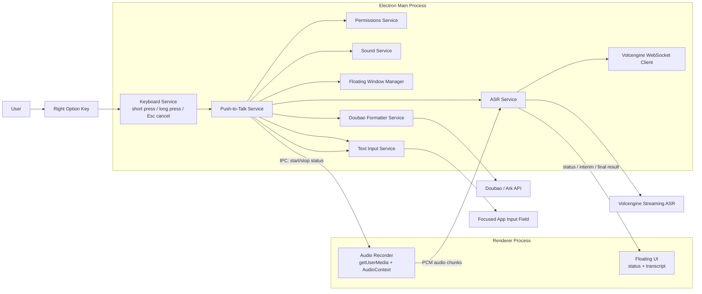

# Open Typeless

> A macOS voice input tool with realtime dictation and LLM-assisted integrated dictation.
>
> 一款 macOS 语音输入工具，支持实时听写与大模型整合转写。

---

## Architecture



## 中文说明

### 项目简介

Open Typeless 是一个面向 macOS 的语音输入工具，围绕“尽量不打断工作流”来设计。

它提供两种输入模式：

- `听写模式`：长按右侧 `Option` 键，实时转写，松手即输入
- `整合模式`：短按右侧 `Option` 键开始识别，再短按一次结束，随后使用豆包大模型进行整理、纠错和结构化输出

### 功能特性

- `双模式语音输入`：同时支持实时听写与整合转写
- `流式 ASR`：基于火山引擎流式语音识别大模型
- `LLM 整理`：去口癖、去重复、处理自我修正、优化表达
- `结构化输出`：自动分段，多事项时自动编号
- `悬浮反馈`：通过浮窗展示当前模式、状态和转写内容
- `不抢焦点输入`：识别完成后直接写入当前光标位置
- `全局快捷键`：后台运行，无需手动切换回应用

### 系统要求

- macOS 12.0 或以上
- Node.js 22
- `pnpm`

### 快速开始

#### 1. 安装依赖

```bash
pnpm install
```

#### 2. 配置环境变量

复制 `.env.example` 到 `.env`：

```bash
cp .env.example .env
```

填写以下配置：

```env
# Volcengine ASR
VOLCENGINE_APP_ID=your_app_id
VOLCENGINE_ACCESS_TOKEN=your_access_token
VOLCENGINE_RESOURCE_ID=volc.bigasr.sauc.duration

# Doubao / Ark
DOUBAO_API_KEY=your_ark_api_key
DOUBAO_MODEL=your_doubao_model_or_endpoint_id
```

#### 3. 启动应用

```bash
pnpm start
```

#### 4. 授权系统权限

首次使用需要授权：

- `麦克风权限`：用于录音
- `辅助功能权限`：用于文字插入
- `输入监控权限`：用于全局监听右侧 `Option` 键

你可以在「系统设置 -> 隐私与安全性」中完成授权。

### 使用方法

#### 听写模式

1. 长按右侧 `Option`
2. 浮窗顶部显示 `听写模式`
3. 下方实时显示 ASR 转写内容
4. 松开按键后，结果自动输入到当前光标位置

#### 整合模式

1. 短按右侧 `Option`
2. 浮窗顶部显示 `整合模式`
3. 下方实时显示 ASR 内容
4. 再短按一次右侧 `Option`
5. 浮窗进入 `Thinking`
6. 豆包模型整理完成后，输出最终文本并自动输入

#### 取消当前听写

- 在听写或整合录音过程中按 `Esc` 可取消本次输入

### 项目结构

```text
src/
├── main.ts
├── preload.ts
├── renderer.ts
├── main/
│   ├── ipc/
│   ├── services/
│   │   ├── asr/           # Volcengine ASR session and WebSocket client
│   │   ├── keyboard/      # Global right-Option gesture detection
│   │   ├── llm/           # Doubao transcript formatter
│   │   ├── permissions/   # macOS permission checks
│   │   ├── push-to-talk/  # Core dictation orchestration
│   │   ├── sound/         # Start/stop sound cues
│   │   └── text-input/    # Insert text into focused app
│   └── windows/           # Floating window lifecycle and sizing
├── renderer/
│   └── src/
│       ├── modules/asr/   # Audio recorder and floating UI
│       └── styles/        # Floating window styling
├── shared/                # Shared types and IPC channel constants
└── types/                 # Global preload API typing
```

### 开发命令

```bash
pnpm start
pnpm typecheck
pnpm lint
pnpm package
pnpm make
```

### 常见问题

#### 为什么第一次启动时麦克风会慢一点？

首次使用时浏览器侧需要完成 `getUserMedia` 和 `AudioContext` 预热，因此第一次响应通常会略慢于后续使用。

#### 为什么按下按键后的前一小段语音也能识别？

当前实现会在 `connecting` 阶段就启动本地录音并缓存音频，等 ASR WebSocket 真正 ready 后再补发，尽量减少前几秒丢字。

#### 如何修改快捷键？

当前默认键位是右侧 `Option`。可以在 [keyboard.service.ts](/Users/nil/Experiment/open-typeless/src/main/services/keyboard/keyboard.service.ts:30) 中调整 `triggerKey`。

## English

### Overview

Open Typeless is a macOS voice input app designed around one principle: keep dictation fast, global, and interruption-free.

It supports two input flows:

- `Realtime Dictation`: hold the right `Option` key, speak, release to insert
- `Integrated Dictation`: tap the right `Option` key to start, tap again to stop, then use Doubao to rewrite and structure the text before insertion

### Features

- `Dual-mode voice input` for direct dictation and LLM-assisted rewrite
- `Streaming ASR` powered by Volcengine speech recognition
- `Transcript cleanup` for filler words, repetitions, and self-corrections
- `Structured output` with paragraphing and conditional numbering
- `Floating feedback window` for mode, status, and transcript visibility
- `Focus-safe insertion` into the currently focused text field
- `Global shortcut workflow` that works while the app stays in the background

### Requirements

- macOS 12.0+
- Node.js 22
- `pnpm`

### Setup

#### 1. Install dependencies

```bash
pnpm install
```

#### 2. Configure environment variables

```bash
cp .env.example .env
```

Then fill in:

```env
VOLCENGINE_APP_ID=your_app_id
VOLCENGINE_ACCESS_TOKEN=your_access_token
VOLCENGINE_RESOURCE_ID=volc.bigasr.sauc.duration
DOUBAO_API_KEY=your_ark_api_key
DOUBAO_MODEL=your_doubao_model_or_endpoint_id
```

#### 3. Start the app

```bash
pnpm start
```

#### 4. Grant macOS permissions

The app needs:

- `Microphone` for audio capture
- `Accessibility` for text insertion
- `Input Monitoring` for listening to the global right `Option` shortcut

Grant them in `System Settings -> Privacy & Security`.

### How It Works

#### Realtime Dictation

1. Hold the right `Option` key
2. The floating window shows `听写模式`
3. Live ASR text appears below
4. Release the key to insert the final transcript

#### Integrated Dictation

1. Tap the right `Option` key
2. The floating window shows `整合模式`
3. Live ASR transcript appears below
4. Tap the right `Option` key again
5. The floating window switches to `Thinking`
6. The Doubao model rewrites the transcript and inserts the final output

#### Cancel

- Press `Esc` during dictation to cancel the current session

### Core Modules

- `Push-to-Talk Service`: coordinates keyboard gestures, ASR lifecycle, LLM rewrite, preview, and insertion
- `ASR Service`: manages connection state, buffered audio, interim/final transcript handling
- `Audio Recorder`: captures microphone input in the renderer and streams PCM chunks
- `Floating Window`: displays mode labels, transcript text, and processing feedback
- `Text Input Service`: writes the final text into the focused app

### Development

```bash
pnpm start
pnpm typecheck
pnpm lint
pnpm package
pnpm make
```

## License

MIT
